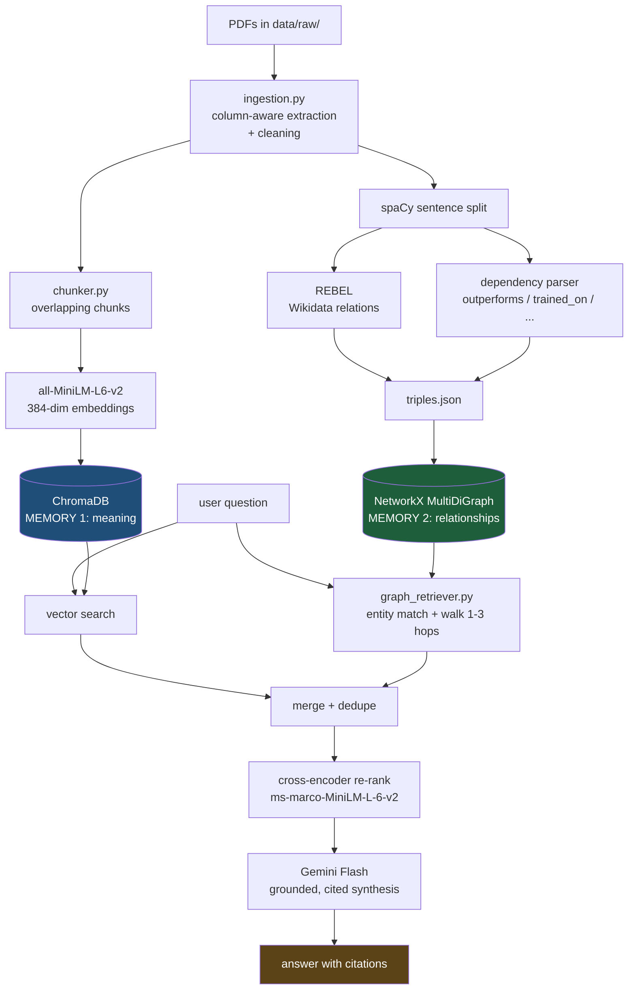

# KG-RAG — Knowledge-Graph-Augmented Retrieval over Research Papers

**Standard RAG can search a corpus. It cannot reason across it.** This system builds two
parallel memories of a paper collection — a vector index for meaning and a knowledge graph
for relationships — and walks the graph to answer questions whose answers exist in no single
document.

Runs entirely on CPU. No GPU anywhere.

---

## The problem, concretely

Ask a normal "chat with your PDFs" system this:

> *Which models outperform Faster R-CNN, and who proposed those models?*

It embeds the question, retrieves the five most similar chunks, and hands them to an LLM.
Those chunks will be topically plausible — detection papers, author lists — and the answer
will be vague or invented. Not because the retrieval was tuned badly, but because **no chunk
of text contains the answer.** Answering requires a chain:

```
Faster R-CNN  ←[outperforms]—  Mask R-CNN  ←[proposed by]—  He et al.
```

Fact 1 is in `mask_rcnn.pdf`. Fact 2 is in its author block. The *connection* is in neither.

Vector search has exactly one move: *find text similar to this text*. It executes that move
once and stops. Following a chain is not a harder version of that move — it is a different
operation, and no chunk size, embedding model, or prompt provides it.

This project adds the missing operation.

<details>
<summary><b>See it fail firsthand</b> (this is the whole motivation)</summary>

```bash
python src/basic_rag.py --demo-limitation
```

Runs one question basic RAG handles well and one it cannot, back to back. The instructive
part is that **the retrieval scores look identical** — around 0.50 in both cases. Retrieval
does not fail loudly. It returns its *k* nearest neighbours as always, none of which holds
the answer, and the LLM hedges or invents a connection.
</details>

---

## Architecture

Two independent memories, built once, searched together.



Retrieval and synthesis are orchestrated as a **LangGraph** workflow, with the two retrievers
running as parallel branches that join at the re-ranker.

---

## How it works, in five steps

1. **Extract and clean.** PyMuPDF pulls text *in reading order* — two-column academic layouts
   interleave columns if you extract naively. Running headers are found by cross-page
   repetition, references are stripped while appendices are preserved, and PDF ligatures are
   normalised (`Efficient` → `Efficient`, which otherwise splits one graph node into two).

2. **Build Memory 1.** Text is split into overlapping ~500-character chunks, embedded with
   `all-MiniLM-L6-v2`, and stored in ChromaDB. Every chunk keeps its source file and page so
   claims can be cited.

3. **Build Memory 2.** Every sentence goes through two relation extractors, producing
   `(subject, relation, object)` triples with provenance. These become a directed multigraph:
   entities are nodes, relations are labelled edges. Similar entity names are merged
   (`A. Vaswani` = `Vaswani`) — but *versioned* names are deliberately kept separate
   (`YOLO` ≠ `YOLOv3`) and linked instead.

4. **Retrieve both ways.** The question is embedded *and* parsed for entities. Vector search
   finds resembling text; graph traversal walks 1–3 hops out from the matched entities,
   preferring edges that match the relation the question asks about. Results are merged,
   de-duplicated, and re-ranked by a cross-encoder that reads question and passage *together*.

5. **Synthesise.** Gemini Flash receives the evidence with each item labelled by how it was
   retrieved, and is instructed to distinguish what a paper **states** from what the graph
   **connects**, to cite everything, and to say plainly when the evidence is insufficient.

---

## Two findings worth reading before you trust the design

**REBEL cannot express the relations this domain needs.** `Babelscape/rebel-large` is trained
on Wikipedia aligned to **Wikidata properties**, so its labels come from that closed
vocabulary: `instance of`, `part of`, `developer`, `use`. There is no `outperforms` property
and never will be. Run `python src/relation_extractor.py` and read the vocabulary it reports.

A graph built on REBEL alone is taxonomically tidy and useless for comparative reasoning — the
flagship question above has no edge to walk. So a second extractor runs over the same
sentences, using spaCy's **dependency parse** to capture `outperforms`, `trained_on`,
`evaluated_on`, `achieves`, `proposes`, `extends`. Dependency parsing rather than regex,
because a regex finds the word "outperforms" but cannot tell you which noun is doing the
outperforming — and direction is the entire value of a directed edge.

**Absolute similarity scores mean nothing on their own.** The canonical demo pairs
*"YOLO is a real-time object detection system"* with *"You Only Look Once detects objects
quickly"* and expects ~0.85. Ours scores **0.48**, and nothing is wrong: cosine similarity has
no absolute scale, and MiniLM compresses its scores into a narrow band. What matters is the
*contrast* — 0.48 against 0.05 for an unrelated pair, a 9.6× separation. This is also why the
cross-encoder earns its place: when candidates sit in a narrow band, you need a sharper judge
to order them.

---

## Results

Twenty questions written against the eight-paper corpus, in three tiers, run through **both**
systems and scored 1–5 by an LLM judge against hand-written reference answers.

```bash
python src/evaluate.py
```

<!-- RESULTS_TABLE_START -->
*Run the command above to generate `data/eval_results.json`; the table is reproduced here from
that file. Per-question answers and scores are saved alongside the scores so any claim can be
checked by hand.*
<!-- RESULTS_TABLE_END -->

**How to read it.** The `simple` tier is not padding — a delta near zero there is the *correct*
result, showing the graph did not damage what already worked. The `hard` tier is where the
graph has to earn its place. The `graph share` column is the honesty check: it reports how much
of the final evidence actually came from traversal. If hard questions score well with a graph
share near zero, the gap came from somewhere else and the claim is unsupported.

The evaluation is designed so it can fail. If KG-RAG matched basic RAG on multi-hop questions,
that would mean five phases of work were not worth it, and that is what the numbers would say.

---

## Tech stack

| Purpose | Library / model | Version | Notes |
|---|---|---|---|
| PDF extraction | PyMuPDF | 1.28.2 | Block geometry for column-aware reading order |
| NLP / parsing | spaCy + `en_core_web_sm` | 3.8.16 | Sentence splitting and dependency parses |
| Relation extraction | `Babelscape/rebel-large` | via transformers 4.57.6 | ~1.6GB, ~1.3 s/sentence on CPU |
| Embeddings | `all-MiniLM-L6-v2` | via sentence-transformers 5.7.0 | 23M params, 384 dims |
| Vector store | ChromaDB | 1.5.9 | Persistent, cosine space |
| Graph | NetworkX | 3.6.1 | `MultiDiGraph` + pickle |
| Entity resolution | thefuzz / RapidFuzz | 0.22.1 / 3.14.5 | C-speed fuzzy matching |
| Re-ranking | `cross-encoder/ms-marco-MiniLM-L-6-v2` | sentence-transformers | ~80M params |
| Orchestration | LangGraph | 1.2.11 | Parallel retrieval branches |
| LLM | Gemini Flash via `google-genai` | 2.19.0 | Groq as fallback |
| Visualisation | pyvis | 0.3.2 | Self-contained interactive HTML |
| UI | Streamlit | 1.62.0 | |
| Runtime | PyTorch | 2.13.0+**cpu** | CPU-only build, deliberately |

> **Deviation from the original spec:** `google-generativeai` is deprecated upstream; this uses
> the supported `google-genai` SDK. Other pinned versions were 2024-era and no longer resolve.

Developed on a Ryzen 7 5700U, 16GB RAM, **no dedicated GPU**. Every model choice is constrained
by that: nothing above ~400M parameters runs locally, and all heavy generation goes to an API.

---

## Setup

```bash
git clone <your-repo-url> && cd kg-rag
python -m venv venv && venv\Scripts\activate        # Linux/macOS: source venv/bin/activate
pip install torch --index-url https://download.pytorch.org/whl/cpu
pip install -r requirements.txt
python -m spacy download en_core_web_sm
```

Add your API key:

```bash
cp .env.example .env       # then edit .env and paste your key
```

Get a free one at [aistudio.google.com/apikey](https://aistudio.google.com/apikey).
**Retrieval (Phases 1–5) works with no key at all** — only answer generation needs it.

Get the test corpus (eight open-access arXiv papers, chosen because they cite and benchmark
against each other, which is what makes the graph interesting):

```bash
python scripts/fetch_papers.py
```

Build both memories:

```bash
python src/vector_store.py                      # ~1 min  - chunks + embeddings
python src/knowledge_extractor.py               # ~50 min - REBEL over the corpus
python src/knowledge_graph.py --rebuild         # ~10 s   - graph from triples
python src/graph_viz.py                         # interactive HTML
```

The extraction step is the slow one and is checkpointed every ~250 sentences, so it can be
interrupted and resumed. For a large corpus, run it overnight. To skip it while exploring, use
`--no-rebel` for the fast dependency-parse extractor only.

Then:

```bash
streamlit run src/app.py
```

---

## Try it

```bash
python src/pipeline.py -i                                   # interactive KG-RAG
python src/basic_rag.py --demo-limitation                   # watch vector-only RAG fail
python src/graph_retriever.py -q "Which models outperform YOLO?"
python src/knowledge_graph.py --path DETR "instance segmentation"
python src/hybrid_retriever.py -q "Who proposed Faster R-CNN?"
python src/evaluate.py                                      # the numbers
```

The learning scripts, in order:

```bash
python notebooks/01_embeddings_demo.py    # what an embedding actually is
python notebooks/02_ner_demo.py           # what NER gets right and badly wrong here
python notebooks/03_langgraph_intro.py    # state, nodes, edges, parallel branches
```

---

## Tests

```bash
pytest tests/ -q
```

120 tests, no API key required. Several encode real bugs found during development, so they
cannot come back:

- the semantic chunker turning 56K characters of Mask R-CNN into 516K of chunks, because
  table rows have no sentence terminators and the "last sentence" carried forward was the
  entire chunk
- reference-stripping deleting ViT's appendix along with its bibliography
- the domain extractor silently returning **zero** triples because spaCy's lemmatizer had been
  disabled for speed, and verb lookup is by lemma
- LangGraph raising `InvalidUpdateError` because two parallel nodes wrote the same state key

---

## Limitations

Stated plainly, because a portfolio project that claims no weaknesses is not credible.

- **Extraction quality bounds everything.** REBEL produces confident errors
  (`SSD --[has part]--> YOLOv3`). The graph inherits them, and no downstream component can
  detect that an edge is wrong. Precision on the domain relations is good; recall is not
  measured.
- **Entity resolution is a heuristic.** Fuzzy matching merges `A. Vaswani` with `Vaswani` and
  keeps `YOLO` apart from `YOLOv3`, but `the DETR model` remains a separate node from `DETR`,
  linked rather than merged. Aggressive merging risks corrupting the graph; conservative
  merging fragments it. There is no clean answer at this scale.
- **The graph only knows what was extracted.** Anything expressed as ordinary prose —
  definitions, caveats, motivation — is invisible to traversal. This is exactly why the
  vector memory is kept rather than replaced.
- **LLM-as-judge is imperfect.** Judges favour longer answers and their own phrasing, and
  Gemini judging Gemini shares blind spots. Both systems face the same judge and the same
  rubric, so the *difference* is more trustworthy than either absolute score. Treat a 0.3 gap
  as noise.
- **Scale is untested beyond ~8 papers.** NetworkX is in-memory; the 300-paper case in the
  original design has not been run. Neo4j would be the move if it did not fit.
- **No conversational memory.** Every question is independent; follow-ups are not resolved.

## Future work

- Precision/recall measurement of extracted triples against a hand-labelled sample
- Neo4j backend, and Cypher instead of hand-written traversal
- Learned entity linking rather than fuzzy string matching
- Query decomposition: split a multi-hop question into sub-questions and walk each separately
- Contradiction detection — surfacing where two papers disagree is the genuinely novel
  application of a corpus-scale knowledge graph

---

## Repository layout

```
src/
  ingestion.py           extraction + cleaning          Phase 1
  chunker.py             fixed + semantic chunking      Phase 1
  vector_store.py        ChromaDB, Memory 1             Phase 2
  basic_rag.py           the baseline to beat           Phase 2
  llm.py                 Gemini/Groq with fallback
  relation_extractor.py  REBEL + domain extractor       Phase 3
  knowledge_extractor.py batch pipeline -> triples.json Phase 3
  knowledge_graph.py     graph + traversal, Memory 2    Phase 4
  graph_viz.py           pyvis visualisation            Phase 4
  graph_retriever.py     natural language -> walk       Phase 5
  hybrid_retriever.py    merge + cross-encoder re-rank  Phase 5
  pipeline.py            LangGraph orchestration        Phase 6
  evaluate.py            20-question harness            Phase 7
  app.py                 Streamlit UI                   Phase 7
notebooks/               three explanatory scripts
tests/                   120 tests
scripts/fetch_papers.py  reproducible arXiv corpus
```

---

## Author

**Jaydeep** — B.Tech Information Technology, VJTI Mumbai (2027)

Built as a study of why retrieval architecture matters more than model size: every model here
is small enough to run on an integrated GPU-less laptop, and the capability gain comes entirely
from how the retrieval is structured.
